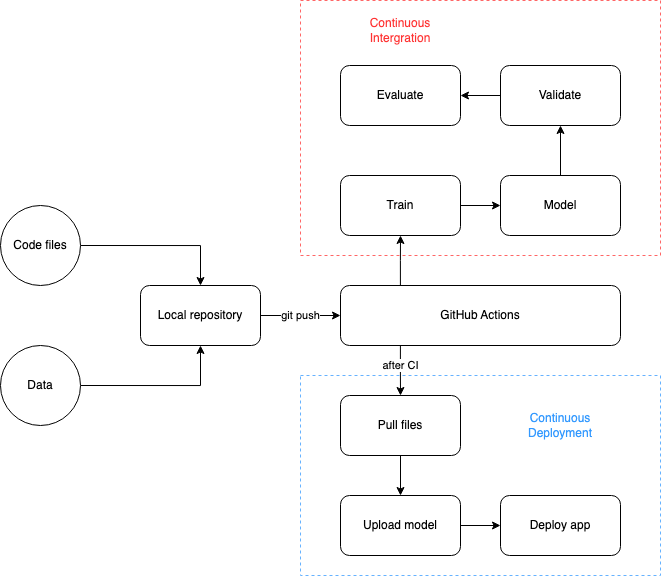
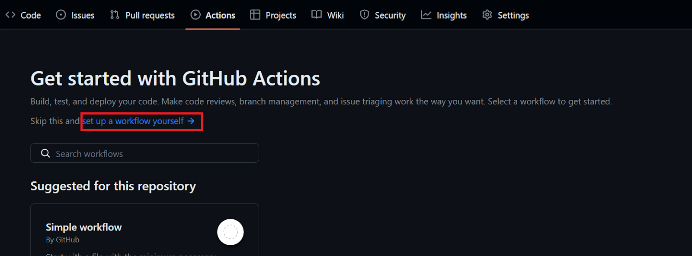

# ML Model Training & Deployment Pipeline

A robust machine learning pipeline for training, validating, and deploying a housing price prediction model with automated performance tracking and continuous deployment.

## 🏗️ Architecture Overview

```
📦 CI-CD-ML
├── 📂 .github/workflows/
│   ├── cd.yml            # Continuous Deployment workflow
│   └── ci.yml            # Continuous Integration workflow
├── 📂 App/
│   ├── housing_app.py    # Application interface
│   ├── README.md         # App documentation
│   └── requirements.txt  # App dependencies
├── 📂 Model/
│   └── housing_model.joblib  # Trained model file
├── 📂 Results/
│   ├── feature_importance.png    # Feature importance visualization
│   ├── metrics.txt              # Current model performance
│   ├── scaler.joblib           # Feature scaler
│   └── xgb_feature_importance.png # XGBoost feature importance
├── 📜 Makefile           # Build and deployment automation
├── 📜 model_validation.py # Model validation and comparison
├── 📜 test_model.py      # Model unit tests
├── 📜 train.py           # Model training script
└── 📜 requirements.txt    # Python dependencies
```

## 📋 CI/CD Pipeline Details



### 🚀 Features

- **Automated Model Training**: Standardized training pipeline using scikit-learn
- **Performance Tracking**: Automatic comparison with previous model versions
- **Continuous Integration**:
  - Code quality checks
  - Unit testing
  - Model validation
  - Performance regression prevention
- **Continuous Deployment**:
  - Automatic deployment to Hugging Face
  - Only deploys when performance improves
  - Metrics version control

### Continuous Integration (`ci.yml`)
```yaml
Triggers:
- Push to main
- Pull requests

Steps:
1. Code formatting
2. Unit tests
3. Model training
4. Performance validation
5. Metrics update
```

### Continuous Deployment (`cd.yml`)
```yaml
Triggers:
- Successful CI completion
- Manual workflow dispatch

Steps:
1. Environment setup
2. Hugging Face authentication
3. Model deployment
```

## 📊 Model Details

The pipeline trains an XGBoost model on the California Housing dataset with:
- Feature standardization
- Train/test split (80/20)
- Performance metrics:
  - Root Mean Squared Error (RMSE)
  - R-squared (R²) score
- Feature importance visualization

## 🛠️ Setup & Installation

1. **Clone the Repository**
   ```bash
   git clone https://github.com/nglinhbao/CI-CD-ML.git
   cd CI-CD-ML
   ```

2. **Configure GitHub Secrets**
   - Go to Repository Settings > Secrets and Variables > Actions
   - Add the following secrets:
     - `HF`: Your Hugging Face API token
     - `USER_EMAIL`: Your email for CI job's notification
     - `USER_NAME`: Your name

3. **Configure GitHub Actions**
   - Go to Repository Settings > Actions > General
   - Enable "Read and write permissions" under Workflow permissions
   - Allow GitHub Actions to create and approve pull requests

4. **GitHub Actions**
To automate training and evaluation, we need to create a GitHub action workflow. To do this, navigate to the “Actions” tab on the repository and click on the blue text “set up a workflow yourself.”


## 🔄 CI/CD Process
   - Push changes to trigger CI pipeline
   - CI automatically:
     - Runs code quality checks
     - Executes tests
     - Trains new model
     - Compares performance
     - Updates metrics if improved
   - CD automatically:
     - Deploys to Hugging Face if CI passes
     - Updates production model

## 📈 Metrics Tracking

The pipeline maintains two metrics files:
- `metrics.txt`: Current model performance
- `previous_metrics.txt`: Previous best model performance

Metrics are updated only when:
- Both RMSE and R² show improvement
- It's the first model version

## 🔧 Make Commands

1. **Setup Commands**
   - `make install`: Sets up the Python environment
     - Upgrades pip to latest version
     - Installs all dependencies from requirements.txt

2. **Code Quality Commands**
   - `make format`: Code formatting using Black
   - `make lint`: Static code analysis (excluding refactor/convention checks)
   - `make test`: Run unit tests with detailed output

3. **Model Commands**
   - `make train`: Execute model training pipeline
   - `make validate`: Compare new model performance with previous version
   - `make eval`: Generate performance report
     - Creates report.md with metrics
     - Includes feature importance visualization
     - Posts report as CML comment

4. **Deployment Commands**
   - `make update-branch`: 
     - Sets Git configuration
     - Commits metrics changes
     - Pushes to update branch
   - `make hf-login`:
     - Installs Hugging Face CLI
     - Authenticates with provided token
     - Switches to update branch
   - `make push-hub`:
     - Uploads App directory to Hugging Face space
     - Syncs Model directory
     - Updates Results/Metrics
   - `make deploy`: Complete Hugging Face deployment

5. **Pipeline Command**
   - `make all`: Executes complete pipeline in order:
     1. Install dependencies
     2. Lint code
     3. Run tests
     4. Train model
     5. Validate performance
     6. Generate evaluation report

### Usage Examples

```bash
# Complete training and deployment workflow
make all && make deploy

# Development workflow
make format && make lint && make test

# Quick model update
make train && make validate

# Generate new report
make eval
```

### Environment Variables Required

- `USER_NAME`: Git username for commits
- `USER_EMAIL`: Git email for commits
- `HF`: Hugging Face API token
